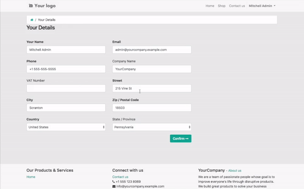

# Website Google Address Form

Website Google Address Form Autocomplete

This module enable [Google Address Form Autocomplete](https://developers.google.com/maps/documentation/javascript/examples/places-autocomplete-addressform) on [Website](https://www.odoo.com/app/website) sale customer form.

Enables the autocomplete for address defined on two website pages:

## Customer form on website sale

## User Portal form

## Autocomplete Restricted to Multiple Countries
Allows you to control by restrict the address to certain countries

